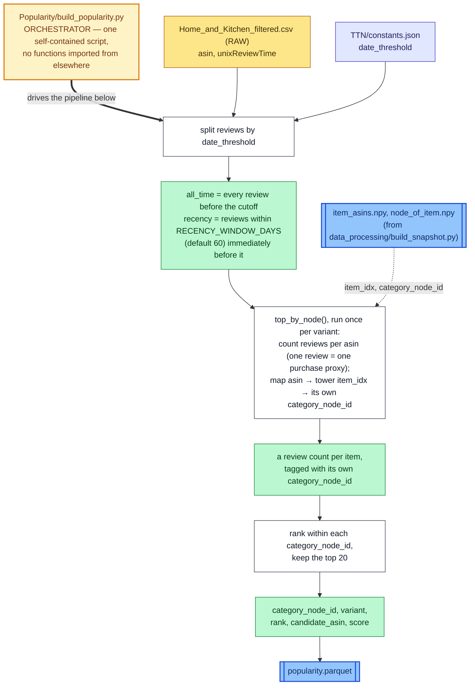

# Popularity — Data Pipeline

How a snapshot's reviews become the "Trending in Category" carousel. For
what Popularity does conceptually, see `Popularity/README.md`. Same diagram
style as `TTN/DATA_PIPELINE.md`: white box = transformation step, colored
box right after it = the variable(s) that step produces, amber box = the
orchestrator script, blue box = a file on disk.

The simplest of the three pipelines — one script, no separate
"model," no functions imported from anywhere else.

## `Popularity/build_popularity.py --snapshot ...`

## Two things worth knowing

- **`RECENCY_WINDOW_DAYS` (60) is unrelated to `window_days`** (the
  co-purchase *pairing* window `data_processing/build_snapshot.py --window-days`
  uses to build TTN's training pairs) — same word, two different concepts,
  living in two different scripts.
- **The README is stale on the output filename.** `Popularity/README.md`
  says the output is `data/tower/<snapshot_id>/popularity_top100.json`; the
  actual script writes `popularity.parquet`, and not even under `data/` —
  see Prerequisites below.

## Prerequisites

Requires `data_processing/build_snapshot.py --window-days N` to have already
run for the given snapshot — reads that snapshot's `item_asins.npy` and
`node_of_item.npy` directly from the shared `data/tower/<snapshot_id>/`.
Output lands in `Popularity/generated/<snapshot_id>/recommendations/popularity.parquet`
— under this model's own folder, not `data/`.
