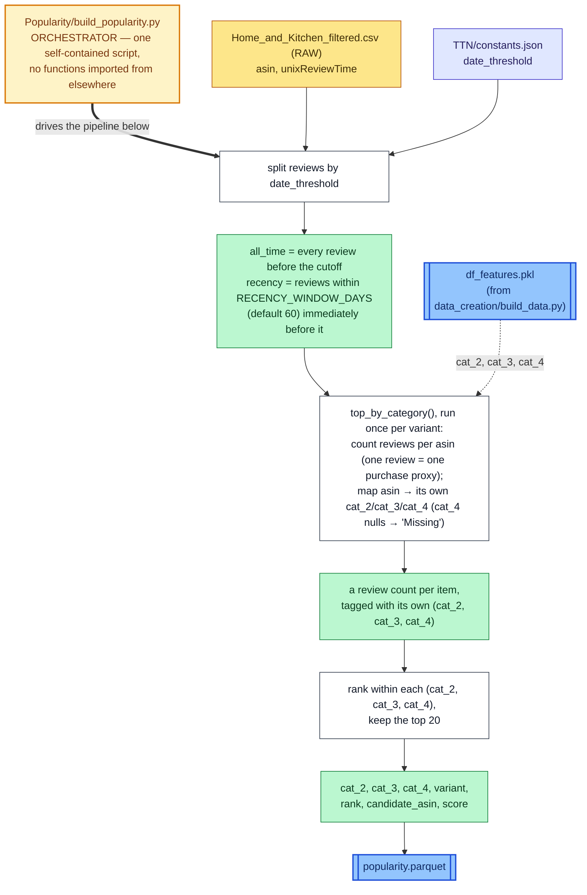

# Popularity — Data Pipeline

How reviews become the "Trending in Category" carousel. For what
Popularity does conceptually, see `Popularity/README.md`. Same diagram
style as `TTN/DATA_PIPELINE.md`: white box = transformation step, colored
box right after it = the variable(s) that step produces, amber box = the
orchestrator script, blue box = a file on disk.

The simplest of the three pipelines — one script, no separate
"model," no functions imported from anywhere else, and — unlike TTN and
SigLIP2 — no `--snapshot` argument at all.

## `Popularity/build_popularity.py`

## Two things worth knowing

- **`RECENCY_WINDOW_DAYS` (60) is unrelated to `window_days`** (the
  co-purchase *pairing* window `data_processing/build_snapshot.py --window-days`
  uses to build TTN's training pairs) — same word, two different concepts,
  living in two different scripts.
- **No longer reads `item_asins.npy`/`node_of_item.npy`.** An earlier
  version restricted counts to TTN's co-purchase-derived item list and
  category vocabulary — an unjustified restriction inherited from reusing
  TTN's infrastructure, not something Popularity's own logic needs.
  Categories now come straight from `df_features.pkl`.

## Prerequisites

Requires `data_creation/build_data.py` to have already produced
`data/df_features.pkl` — no `data_processing/build_snapshot.py` step, no
`--snapshot` argument, no dependency on any `--window-days` choice at all.
Output lands in `Popularity/generated/recommendations/popularity.parquet`
— one universal file, under this model's own folder, not `data/` and not
scoped to any snapshot.
