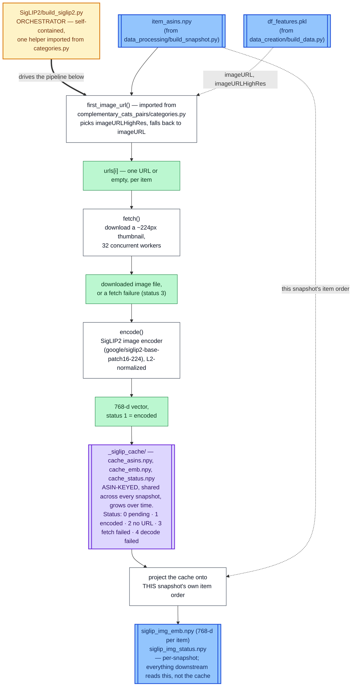
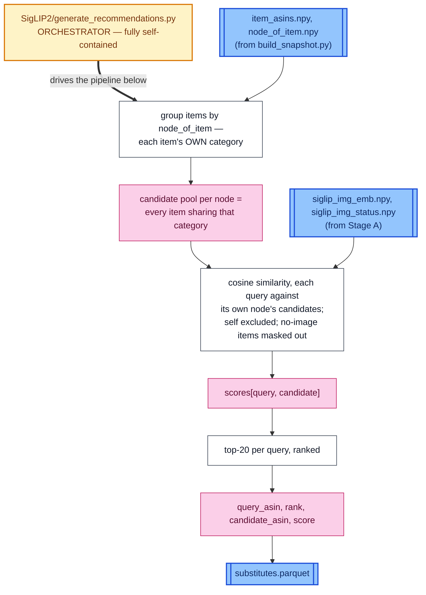

# SigLIP2 — Data Pipeline

How a snapshot's items become "Visually Similar Products" recommendations.
For what SigLIP2 does conceptually, see `SigLIP2/README.md`. Same diagram
style as `TTN/DATA_PIPELINE.md`: white box = transformation step, colored
box right after it = the variable(s) that step produces, amber box = the
orchestrator script, blue box = a file on disk.

Much shorter pipeline than TTN's — no text/attribute extraction, just:
item → image URL → image bytes → embedding → similarity ranking.

## Stage A — `SigLIP2/build_siglip2.py --snapshot ...`

Resumable, asin-keyed cache shared across every snapshot (an item's photo
doesn't change just because a different `--window-days` snapshot orders
items differently).

~28% of the catalogue has no usable image and ends up as a zero vector
(status 2, 3, or 4) — the same convention TTN uses for items with no
description.

## Stage B — `SigLIP2/generate_recommendations.py --snapshot ...`

An item with no usable image (~28% of the catalogue) can't be ranked by
this signal and is skipped as a query entirely — it can still appear as a
*candidate* for other queries in its category, just never as the query
itself.

## Prerequisites

Both stages require `data_processing/build_snapshot.py --window-days N` to
have already run for the given snapshot — Stage A reads `item_asins.npy`,
Stage B additionally reads `node_of_item.npy`. Stage A also reads
`df_features.pkl` (from `data_creation/build_data.py`) for image URLs.

Outputs land in `data/tower/<snapshot_id>/` (Stage A) and
`data/tower/<snapshot_id>/recommendations/` (Stage B).
