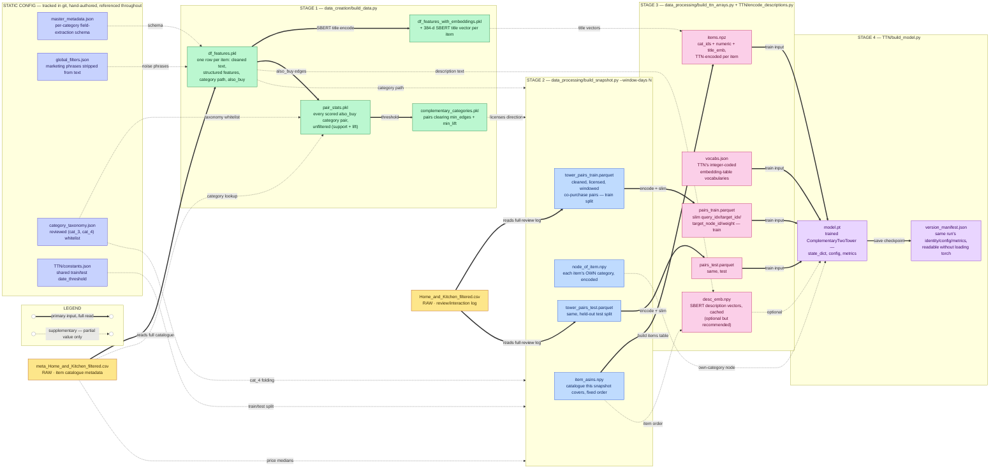

# TTN — Data Pipeline

How the two raw files become the arrays `TTN/build_model.py` trains on.
For what the model itself does, see `TTN/README.md`.

## Overview

The two raw files sit at the far left. The static config/constants files sit
in a row at the **top** — they're referenced throughout, not consumed once
and discarded, so they're pulled out of the main left-to-right chain instead
of cluttering it. The main chain reads left to right, stage by stage; every
table/array node is labeled with what it actually contains.

**Line style — see the legend at the top of the diagram:**
- **Thick solid (`━━▶`)** — the primary input a stage reads to build its output (a full file, or the direct predecessor artifact).
- **Thin dotted (`┈┈▶`)** — a supplementary value pulled in alongside the primary input (one column, a threshold, a whitelist set) — not the whole file.



## Variable-level lineage

The file-level diagram above shows which *files* feed which. This one instead
follows each *variable* TTN actually trains on — one lane per variable (or
group of identically-treated variables), left to right through the stage that
touches it, ending at the exact array/vocab it lands in. `description`/
`desc_emb` is left out here (see the tables below if you need it); so is
everything past this point — how the model itself consumes these arrays.

```mermaid
flowchart TB
    classDef raw fill:#fde68a,stroke:#b45309,color:#3f2d05
    classDef stage1 fill:#bbf7d0,stroke:#15803d,color:#0b3a1e
    classDef stage2 fill:#bfdbfe,stroke:#1d4ed8,color:#0f2a63
    classDef stage3 fill:#fbcfe8,stroke:#be185d,color:#5c0d31
    classDef discard fill:#fecaca,stroke:#b91c1c,color:#450a0a
    classDef pass fill:#f4f4f5,stroke:#a1a1aa,color:#3f3f46

    subgraph V1["cat_2 / cat_3"]
        direction LR
        V1R["category (breadcrumb list)<br/>meta CSV"]:::raw
        V1S1["cat_2, cat_3<br/>ensure_cat_columns() splits the breadcrumb"]:::stage1
        V1S2["query_/target_cat_2, cat_3<br/>attached to pairs; vocab fit on train;<br/>missing → 'Missing'"]:::stage2
        V1S3["cat_ids[:,0], cat_ids[:,1]<br/>vocabs['cat_2'], vocabs['cat_3']"]:::stage3
        V1R --> V1S1 --> V1S2 --> V1S3
    end

    subgraph V2["cat_4"]
        direction LR
        V2R["category (breadcrumb list)<br/>meta CSV"]:::raw
        V2S1["cat_4 (raw level)<br/>ensure_cat_columns()"]:::stage1
        V2S2["cat_4_clean<br/>folded via category_taxonomy.json:<br/>outside whitelist → '&lt;cat_3&gt;_Other'"]:::stage2
        V2S3["cat_ids[:,2]<br/>vocabs['cat_4']"]:::stage3
        V2R --> V2S1 --> V2S2 --> V2S3
    end

    subgraph V3["brand"]
        direction LR
        V3R["brand<br/>meta CSV"]:::raw
        V3S1["brand_clean (v1)<br/>clean_brand(): spelling-merge<br/>+ rare-fold"]:::discard
        V3X["✕ discarded —<br/>never read downstream"]:::discard
        V3S2["brand_clean (v2, overwrites v1)<br/>recomputed straight from raw brand;<br/>rare-fold refit train-only, no spelling-merge"]:::stage2
        V3S3["cat_ids[:,3]<br/>vocabs['brand']"]:::stage3
        V3R --> V3S1 -.-> V3X
        V3R --> V3S2 --> V3S3
    end

    subgraph V4["color / material / product_type / features"]
        direction LR
        V4R["title/description/feature text<br/>meta CSV"]:::raw
        V4S1["Color, Material, Product_Type, Features<br/>extracted via master_metadata.json schema,<br/>then canonicalize_values() folds spelling variants"]:::stage1
        V4S2["query_/target_color/material/<br/>product_type/features<br/>attached to pairs; vocab fit;<br/>missing → 'Missing'"]:::stage2
        V4S3["cat_ids[:,4..7]<br/>vocabs['color'|'material'|'product_type'|'features']"]:::stage3
        V4R --> V4S1 --> V4S2 --> V4S3
    end

    subgraph V5["price"]
        direction LR
        V5R["price (string)<br/>meta CSV"]:::raw
        V5P["carried through unchanged<br/>(no Stage 1 transform)"]:::pass
        V5S2["numeric price;<br/>missing imputed hierarchically<br/>(cat_4→cat_3→cat_2→global, train-fit);<br/>price_imputed flag added"]:::stage2
        V5S3["numeric[:,0..2]<br/>log1p(price), price decile, price_imputed"]:::stage3
        V5R --> V5P --> V5S2 --> V5S3
    end

    subgraph V6["title"]
        direction LR
        V6R["title<br/>meta CSV"]:::raw
        V6S1["title_cleaned → title_embedding<br/>clean_text() then SBERT (384-d)<br/>→ df_features_with_embeddings.pkl"]:::stage1
        V6P["title_cleaned carried onto pairs<br/>(text itself not reused)"]:::pass
        V6S3["items.npz['title_emb']<br/>reused by asin, not recomputed"]:::stage3
        V6R --> V6S1 --> V6P --> V6S3
    end

    subgraph V7["target_node"]
        direction LR
        V7R["query_/target_cat_2/3/4<br/>(already vocab-applied, Stage 2)"]:::stage2
        V7S2["target_node string<br/>= cat_2 + ' &gt; ' + cat_3 + ' &gt; ' + cat_4<br/>vocab fit on train"]:::stage2
        V7S3a["node_of_item.npy<br/>Stage 2's own encoding —<br/>item's OWN category"]:::stage2
        V7S3b["vocabs['target_node'] + target_node_id<br/>Stage 3's own, separate encoding —<br/>pair's TARGET category"]:::stage3
        V7R --> V7S2
        V7S2 --> V7S3a
        V7S2 --> V7S3b
    end
```



**Two things this graph surfaces that the file-level one doesn't:**
- **`brand` is computed twice, and the second computation wins** — Stage 1's `clean_brand()` spelling-merge is thrown away; `build_snapshot.py` looks for a `"brand_norm"` column, doesn't find one, and silently recomputes `brand_clean` from the raw `brand` string instead.
- **`target_node` is encoded twice, independently** — once in Stage 2 (`node_of_item.npy`) and once in Stage 3 (`vocabs["target_node"]`). Both sort the same underlying set of strings the same way, so the ids match today, but they aren't the same computation — a change to one without the other would silently desync them.

## Stage 1 — `data_creation/build_data.py`

Item-level, **window_days-independent** — run once, reused by every snapshot.
Resumable: each step is skipped (existing file reused) unless `--force`.

| # | Reads | Modifications | Writes |
|---|---|---|---|
| 1a | `meta_Home_and_Kitchen_filtered.csv` | Parse `title`/`description`/`feature` per `master_metadata.json`'s per-category schema → `title_cleaned` etc. Cleaning: lowercase, spell out numbers, space digit-unit pairs, strip non-`[a-z0-9\s.\-]` chars, drop stopwords, lemmatize, strip `global_filters.json` boilerplate phrases. Structured fields (brand, dimensions, numeric ranges) extracted from the cleaned text and flattened/canonicalized. | `df_features.pkl` — one row per item: cleaned text, structured features, category path, `also_buy` |
| 1b | `df_features.pkl` | SBERT (`all-MiniLM-L6-v2`) encodes `title_cleaned` → 384-d unit-norm vector per item | `df_features_with_embeddings.pkl` |
| 1c | `df_features.pkl`'s `also_buy` lists, `category_taxonomy.json`, `meta_Home_and_Kitchen_filtered.csv` (for target-category lookup) | Explode each item's `also_buy` into (source category → target category) edges, resolving each target's category or marking it `"Not in catalogue"`. Aggregate into distinct category pairs, score `support` and `lift` (both directions kept separately). | `pair_stats.pkl` — every scored pair, unfiltered (cached; expensive step) |
| 1d | `pair_stats.pkl` | Keep pairs where `edges >= min_edges` **and** `lift >= min_lift` (both required — support alone rewards popular categories, lift alone rewards one-off flukes). Recomputed every run (cheap) so thresholds can be retried without rescoring. | `complementary_categories.pkl` |

## Stage 2 — `data_processing/build_snapshot.py --window-days N`

Shared by TTN, SigLIP2, and Popularity. Re-reads the raw review log directly
(separately from stage 1) to build the co-purchase pairs.

| Step | Modification |
|---|---|
| 1 | Split `Home_and_Kitchen_filtered.csv` into train/test by `unixReviewTime` vs. `TTN/constants.json`'s `date_threshold` |
| 2 | `co_purchase_pairs(window_days=N)` per split — two purchases by the same reviewer within `N` days count as "bought together" |
| 3 | Join both ends of each pair to `df_features.pkl`'s `cat_2/3/4` |
| 4 | Fold `cat_4` values outside `category_taxonomy.json`'s whitelist into `"<cat_3>_Other"` |
| 5 | **License direction**: keep only `(query→target)` rows whose category pair clears `complementary_categories.pkl` (A→B and B→A checked independently) |
| 6 | Fold rare brands, **fit on train only** (< 10 items → `"other_brands"`) |
| 7 | Attach full item attributes to both sides (title, price, brand, color, material, product_type, features) |
| 8 | Fit categorical vocabularies **on train only**, cast both splits |
| 9 | Impute missing prices hierarchically (median by cat_2/3/4 → cat_2/3 → cat_2 → global), **fit on train-reviewed items only**; flag imputed rows |
| 10 | Fill missing categoricals with `"Missing"` |
| 11 | Build `target_node` = `target_cat_2 > target_cat_3 > target_cat_4`; vocabulary fit on train, unseen test values → `"Missing"` |
| 12 | **Drop same-category pairs** (`query_cat_4 == target_cat_4`) — those are substitutes, not complements |

Outputs land in `data/tower/w{N}_{date_threshold}/`:
`item_asins.npy`, `node_of_item.npy` (shared), `tower_pairs_{train,test}.parquet` (TTN-only), `snapshot_manifest.json`.

## Stage 3 — `data_processing/build_ttn_arrays.py --snapshot ...`

TTN-only encoding, picks up stage 2's `tower_pairs_{train,test}.parquet`.

| Step | Modification |
|---|---|
| 1 | Dedup both sides/splits into one items table, keyed by asin |
| 2 | **Fit TTN's own integer-coded embedding vocabularies, train only** (distinct from stage 2's categorical dtypes) — id `0` reserved for padding/unseen |
| 3 | Encode categorical attrs → `cat_ids` int matrix |
| 4 | Encode price → `numeric` block: `log1p(price)`, price decile (normalized), imputed-flag |
| 5 | **Reuse** title vectors from `df_features_with_embeddings.pkl` (matched by asin, zero-vector if missing) — not recomputed |
| 6 | Slim wide pairs down to `(query_idx, target_idx, target_node_id, weight)` |
| 7 | Assert no *training* item/node lands on reserved id 0 (would mean a vocabulary bug); report how many *test-only* items/nodes do (expected) |

Outputs (same snapshot dir): `items.npz` (`title_emb`, `cat_ids`, `numeric`), `vocabs.json`, `pairs_{train,test}.parquet`.

## Stage 3b (optional, recommended) — `TTN/encode_descriptions.py --snapshot ...`

Runs standalone rather than inside stage 3 — SBERT alongside `df_features` (2.9 GB) and the embeddings pickle (4.3 GB) stalls badly on 16 GB machines.
SBERT-encodes `description_cleaned` (from `df_features.pkl`, truncated at 1200 chars), aligned row-for-row with `items.npz`. → `desc_emb.npy`.
`build_ttn_arrays.py` and `build_model.py` both pick this file up automatically if present; if absent, the model trains without the description block.

## Stage 4 — `TTN/build_model.py --snapshot ...`

No further data transformation — reads only what stages 2-3b produced
(`items.npz`, `vocabs.json`, `node_of_item.npy`, `pairs_{train,test}.parquet`, `desc_emb.npy` if present), trains `ComplementaryTwoTower` with a BPR pairwise loss over co-purchase pairs, and saves a versioned checkpoint:

```
data/tower/w{N}_{date_threshold}/models/ttn/<date>_v_00x/
  model.pt                state_dict, config, vocab_sizes, price standardisation, metrics
  version_manifest.json   same identity/config/metrics, readable without loading torch
```

A saved version is a **candidate**, not the champion — promotion is a separate, deliberate step.

## Design principle running through every stage

Anything **fitted** (vocabularies, brand folding, price-imputation medians, embedding-table ids) is fit on **train only** and applied to test — never the reverse. This is what makes `test-only items` / `unseen values falling on id 0` an expected, printed number rather than a silent leak.
