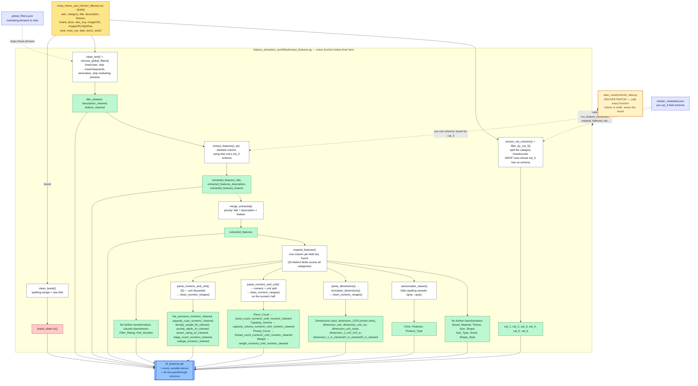
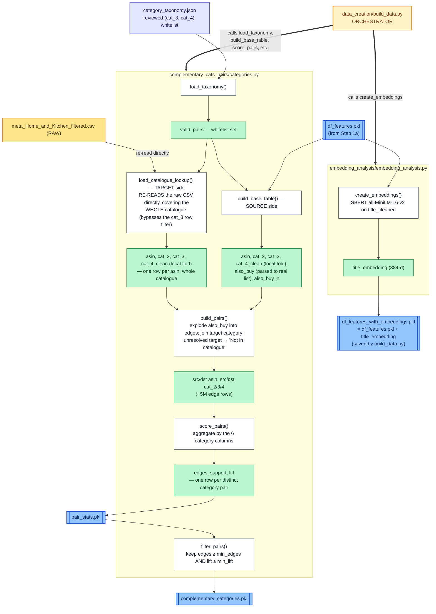
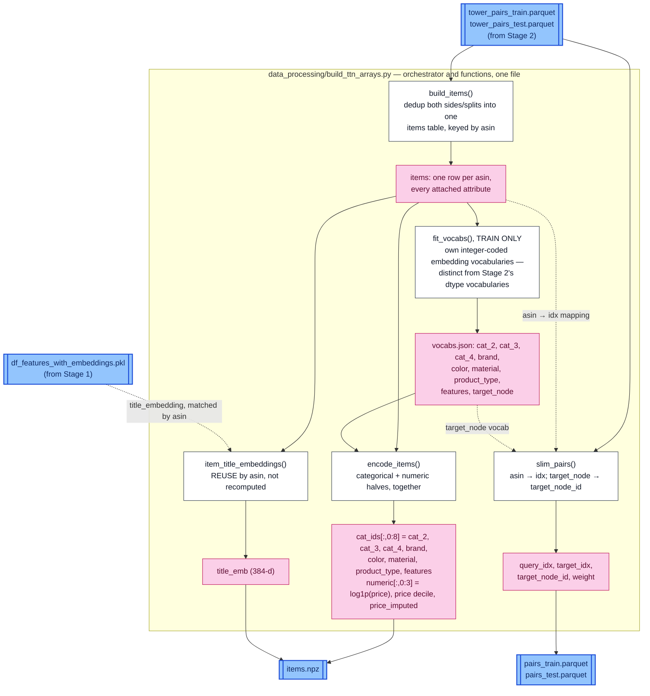

# TTN — Data Pipeline

How the two raw files become the arrays `TTN/build_model.py` trains on.
For what the model itself does, see `TTN/README.md`.

Each stage below has its own diagram, in the same style: a white box is a
**transformation step** (the function that runs), and the colored box right
after it is the **variable(s) that step actually produces** — so you can
read straight down any branch and see exactly what happens to a value from
raw text to model input. Config files (yellow) attach with a labeled arrow
naming exactly what they're used for.

## Stage 1 — `data_creation/build_data.py`

Item-level, **window_days-independent** — run once, reused by every
snapshot. Resumable: each step is skipped (existing file reused) unless
`--force`. `build_data.py` is the **orchestrator** — it doesn't contain
transformation logic itself, it just calls functions from other files in
order and saves whatever they return. The diagrams below show which file
each function actually lives in.

### Step 1a — item feature extraction


```mermaid
flowchart TB
    classDef raw fill:#fde68a,stroke:#b45309,color:#3f2d05
    classDef config fill:#e0e7ff,stroke:#4338ca,color:#241d5c
    classDef proc fill:#ffffff,stroke:#374151,color:#111827
    classDef vars fill:#bbf7d0,stroke:#15803d,color:#0b3a1e
    classDef discard fill:#fecaca,stroke:#b91c1c,color:#450a0a
    classDef file fill:#93c5fd,stroke:#1d4ed8,color:#0f2a63,stroke-width:2px
    classDef orch fill:#fef3c7,stroke:#d97706,color:#78350f,stroke-width:2px

    ORCH["data_creation/build_data.py<br/>ORCHESTRATOR — calls every function<br/>below, in order, saves the result"]:::orch

    RAW["meta_Home_and_Kitchen_filtered.csv (RAW)<br/>asin, category, title, description, feature,<br/>brand, price, also_buy, imageURL, imageURLHighRes,<br/>rank, main_cat, date, tech1, tech2"]:::raw
    CFG1["master_metadata.json<br/>per-cat_3 field schema"]:::config
    CFG2["global_filters.json<br/>marketing phrases to strip"]:::config

    subgraph FILE1[" feature_extraction_workflow/extract_features.py — every function below lives here "]
        direction TB
        P_CAT["ensure_cat_columns() + filter_by_cat_3()<br/>split the category breadcrumb;<br/>DROP rows whose cat_3 has no schema"]:::proc
        V_CAT["cat_1, cat_2, cat_3, cat_4, cat_5, cat_6"]:::vars

        P_CLEAN["clean_text() + remove_global_filters()<br/>lowercase, strip noise/stopwords,<br/>lemmatize, strip marketing phrases"]:::proc
        V_CLEAN["title_cleaned, description_cleaned,<br/>feature_cleaned"]:::vars

        P_EXTRACT["extract_features(), per cleaned column,<br/>using that row's cat_3 schema"]:::proc
        V_EXTRACT["extracted_features_title,<br/>extracted_features_description,<br/>extracted_features_feature"]:::vars

        P_MERGE["merge_extracted()<br/>priority: title &gt; description &gt; feature"]:::proc
        V_MERGE["extracted_features"]:::vars

        P_EXPAND["expand_features()<br/>one column per field key found<br/>(25 distinct fields across all categories)"]:::proc

        V_NOCHANGE["No further transformation:<br/>Brand, Material, Theme, Size, Shape,<br/>Sub_Type, Scent, Shape_Style"]:::vars
        P_CANON["canonicalize_values()<br/>folds spelling variants (grey→gray)"]:::proc
        V_CANON["Color, Features, Product_Type"]:::vars
        P_DIM["parse_dimensions() → normalize_dimensions()<br/>→ clean_numeric_ranges()"]:::proc
        V_DIM["Dimensions (raw), dimension_1/2/3 (mixed units),<br/>dimension_unit, dimension_unit_src, dimension_unit_clean,<br/>dimension_1_in/2_in/3_in,<br/>dimension_1_in_cleaned/2_in_cleaned/3_in_cleaned"]:::vars
        P_NUMUNIT["parse_numeric_and_unit() → numeric + unit split<br/>→ clean_numeric_ranges() on the numeric half"]:::proc
        V_NUMUNIT["Piece_Count → piece_count_numeric/_unit/_numeric_cleaned<br/>Capacity_Volume → capacity_volume_numeric/_unit/_numeric_cleaned<br/>Thread_Count → thread_count_numeric/_unit/_numeric_cleaned<br/>Weight → weight_numeric/_unit/_numeric_cleaned"]:::vars
        P_NUMONLY["parse_numeric_and_unit()[0] — unit discarded<br/>→ clean_numeric_ranges()"]:::proc
        V_NUMONLY["bar_pressure_numeric/_cleaned, capacity_cups_numeric/_cleaned,<br/>density_weight_lb/_cleaned, pocket_depth_in/_cleaned,<br/>power_rating_w/_cleaned, stage_count_numeric/_cleaned,<br/>voltage_numeric/_cleaned"]:::vars
        V_IGNORED["No further transformation, unused downstream:<br/>Filter_Rating, Part_Number"]:::vars

        P_BRAND["clean_brand()<br/>spelling-merge + rare-fold"]:::proc
        V_BRAND["brand_clean (v1)"]:::discard
    end

    DFFEATURES[["df_features.pkl<br/>= every variable above<br/>+ all raw passthrough columns"]]:::file

    ORCH ==>|calls run_feature_extraction,<br/>expand_features, etc.| FILE1

    RAW --> P_CAT
    CFG1 -.keys used as the row filter.-> P_CAT
    P_CAT --> V_CAT --> DFFEATURES

    RAW --> P_CLEAN
    CFG2 -.strips these phrases.-> P_CLEAN
    P_CLEAN --> V_CLEAN --> P_EXTRACT
    V_CLEAN --> DFFEATURES
    CFG1 -.per-row schema, keyed by cat_3.-> P_EXTRACT
    P_EXTRACT --> V_EXTRACT --> P_MERGE
    V_EXTRACT --> DFFEATURES
    P_MERGE --> V_MERGE --> P_EXPAND
    V_MERGE --> DFFEATURES

    P_EXPAND --> V_NOCHANGE --> DFFEATURES
    P_EXPAND --> P_CANON --> V_CANON --> DFFEATURES
    P_EXPAND --> P_DIM --> V_DIM --> DFFEATURES
    P_EXPAND --> P_NUMUNIT --> V_NUMUNIT --> DFFEATURES
    P_EXPAND --> P_NUMONLY --> V_NUMONLY --> DFFEATURES
    P_EXPAND --> V_IGNORED --> DFFEATURES

    RAW -->|brand| P_BRAND --> V_BRAND --> DFFEATURES
```

### Steps 1b–1d — embeddings, then category-pair scoring


```mermaid
flowchart TB
    classDef raw fill:#fde68a,stroke:#b45309,color:#3f2d05
    classDef config fill:#e0e7ff,stroke:#4338ca,color:#241d5c
    classDef proc fill:#ffffff,stroke:#374151,color:#111827
    classDef vars fill:#bbf7d0,stroke:#15803d,color:#0b3a1e
    classDef file fill:#93c5fd,stroke:#1d4ed8,color:#0f2a63,stroke-width:2px
    classDef orch fill:#fef3c7,stroke:#d97706,color:#78350f,stroke-width:2px

    ORCH["data_creation/build_data.py<br/>ORCHESTRATOR"]:::orch

    DFFEATURES[["df_features.pkl<br/>(from Step 1a)"]]:::file
    RAW["meta_Home_and_Kitchen_filtered.csv (RAW)"]:::raw
    CFG3["category_taxonomy.json<br/>reviewed (cat_3, cat_4) whitelist"]:::config

    subgraph FILE2[" embedding_analysis/embedding_analysis.py "]
        P_EMBED["create_embeddings()<br/>SBERT all-MiniLM-L6-v2 on title_cleaned"]:::proc
        V_EMBED["title_embedding (384-d)"]:::vars
    end
    DFEMB[["df_features_with_embeddings.pkl<br/>= df_features.pkl + title_embedding<br/>(saved by build_data.py)"]]:::file

    subgraph FILE3[" complementary_cats_pairs/categories.py "]
        direction TB
        P_TAXO["load_taxonomy()"]:::proc
        V_TAXO["valid_pairs — whitelist set"]:::vars
        P_BASE["build_base_table() — SOURCE side"]:::proc
        V_BASE["asin, cat_2, cat_3, cat_4_clean (local fold),<br/>also_buy (parsed to real list), also_buy_n"]:::vars
        P_LOOKUP["load_catalogue_lookup() — TARGET side<br/>RE-READS the raw CSV directly, covering the<br/>WHOLE catalogue (bypasses the cat_3 row filter)"]:::proc
        V_LOOKUP["asin, cat_2, cat_3, cat_4_clean (local fold)<br/>— one row per asin, whole catalogue"]:::vars
        P_BUILDPAIRS["build_pairs()<br/>explode also_buy into edges; join target category;<br/>unresolved target → 'Not in catalogue'"]:::proc
        V_EDGES["src/dst asin, src/dst cat_2/3/4<br/>(~5M edge rows)"]:::vars
        P_SCORE["score_pairs()<br/>aggregate by the 6 category columns"]:::proc
        V_SCORE["edges, support, lift<br/>— one row per distinct category pair"]:::vars
        P_FILTER["filter_pairs()<br/>keep edges ≥ min_edges AND lift ≥ min_lift"]:::proc
    end

    DFPAIRSTATS[["pair_stats.pkl"]]:::file
    DFCOMPCATS[["complementary_categories.pkl"]]:::file

    ORCH ==>|calls create_embeddings| FILE2
    ORCH ==>|calls load_taxonomy,<br/>build_base_table, score_pairs, etc.| FILE3

    DFFEATURES --> P_EMBED --> V_EMBED --> DFEMB

    DFFEATURES --> P_BASE
    CFG3 --> P_TAXO --> V_TAXO --> P_BASE
    V_TAXO --> P_LOOKUP
    RAW -->|re-read directly| P_LOOKUP
    P_BASE --> V_BASE --> P_BUILDPAIRS
    P_LOOKUP --> V_LOOKUP --> P_BUILDPAIRS
    P_BUILDPAIRS --> V_EDGES --> P_SCORE --> V_SCORE --> DFPAIRSTATS
    DFPAIRSTATS --> P_FILTER --> DFCOMPCATS
```

| # | File(s) responsible | Reads | Modifications | Writes |
|---|---|---|---|---|
| 1a | orchestrator: `build_data.py` · functions: `extract_features.py` | `meta_Home_and_Kitchen_filtered.csv` | Category split + `cat_3` row filter, text cleaning, schema-driven attribute extraction, canonicalization, brand fold, dimension/numeric cleaning | `df_features.pkl` |
| 1b | orchestrator: `build_data.py` · functions: `embedding_analysis.py` | `df_features.pkl` | SBERT (`all-MiniLM-L6-v2`) encodes `title_cleaned` → 384-d unit-norm vector per item | `df_features_with_embeddings.pkl` |
| 1c | orchestrator: `build_data.py` · functions: `categories.py` | `df_features.pkl`'s `also_buy`/`cat_2`/`cat_3`, `category_taxonomy.json`, a second direct read of `meta_Home_and_Kitchen_filtered.csv` | Explode `also_buy` into edges, resolve each target's category, score `support`/`lift` per distinct category pair | `pair_stats.pkl` |
| 1d | orchestrator: `build_data.py` · functions: `categories.py` | `pair_stats.pkl` | Keep pairs where `edges >= min_edges` **and** `lift >= min_lift` | `complementary_categories.pkl` |

**Two things worth remembering from this stage:**
- `brand_clean (v1)` (spelling-merge + rare-fold, shown in red) is computed here but **discarded** — Stage 2 recomputes `brand_clean` from scratch from raw `brand` and that's the version that survives.
- `cat_4` gets folded via the taxonomy whitelist **twice** in this stage alone — once in `build_base_table` (source side), once in `load_catalogue_lookup` (target side, from a fresh read of the raw CSV) — and a third time in Stage 2. All three use the same whitelist and logic, so they agree, but they're independent computations.

## Stage 2 — `data_processing/build_snapshot.py --window-days N`

Shared by TTN, SigLIP2, and Popularity. Re-reads the raw review log directly
(separately from Stage 1) to build the co-purchase pairs. Unlike Stage 1,
almost everything below is written directly in `build_snapshot.py` itself —
it's both orchestrator and logic. The one exception is `co_purchase_pairs()`
(the `P_COPAIR` step), imported from `complementary_cats_pairs/pairs.py`.


```mermaid
flowchart TB
    classDef raw fill:#fde68a,stroke:#b45309,color:#3f2d05
    classDef config fill:#e0e7ff,stroke:#4338ca,color:#241d5c
    classDef proc fill:#ffffff,stroke:#374151,color:#111827
    classDef vars fill:#bfdbfe,stroke:#1d4ed8,color:#0f2a63
    classDef file fill:#93c5fd,stroke:#1d4ed8,color:#0f2a63,stroke-width:2px

    RAWREV["Home_and_Kitchen_filtered.csv (RAW)<br/>asin, reviewerID, unixReviewTime"]:::raw
    DFFEAT[["df_features.pkl<br/>(from Stage 1)"]]:::file
    COMPCATS[["complementary_categories.pkl<br/>(from Stage 1)"]]:::file
    CFG4["TTN/constants.json<br/>date_threshold"]:::config
    CFG3["category_taxonomy.json<br/>(cat_3, cat_4) whitelist"]:::config

    P_SPLIT["Split reviews into train/test<br/>by unixReviewTime vs. date_threshold"]:::proc
    V_SPLIT["train reviews, test reviews"]:::vars

    P_COPAIR["co_purchase_pairs(window_days=N), per split<br/>same reviewer, within N days"]:::proc
    V_COPAIR["asinA, asinB co-purchase pairs<br/>(train and test, separately)"]:::vars

    P_JOIN["Join both ends to df_features.pkl's<br/>cat_2, cat_3, cat_4"]:::proc
    P_FOLD4["Fold cat_4 (manual inline, same logic<br/>as fold_cat_4) — 3rd independent computation"]:::proc
    V_FOLD4["query_/target_cat_2, cat_3, cat_4<br/>(cat_4 folded to '&lt;cat_3&gt;_Other' if outside whitelist)"]:::vars

    P_LICENSE["License direction: keep only rows whose<br/>category pair clears complementary_categories.pkl<br/>(A→B and B→A checked independently)"]:::proc

    P_BRAND2["Fold rare brands from RAW brand,<br/>fit on TRAIN items only, MIN_ITEMS=10<br/>— 2nd, independent brand_clean computation"]:::proc
    V_BRAND2["brand_clean (v2) — this is the version<br/>that actually reaches the model"]:::vars

    P_ATTACH["Attach full item attributes to both sides"]:::proc
    V_ATTACH["query_/target_title_cleaned, price,<br/>brand_clean, color, material,<br/>product_type, features"]:::vars

    P_VOCAB["Fit categorical dtype vocabularies,<br/>TRAIN ONLY; cast both splits"]:::proc

    P_IMPUTE["Impute missing prices hierarchically<br/>(median by cat_2/3/4 → cat_2/3 → cat_2 → global),<br/>fit on train-reviewed items only"]:::proc
    V_IMPUTE["query_/target_price (imputed),<br/>price_imputed flag"]:::vars

    P_FILLCAT["Fill missing categoricals with 'Missing'"]:::proc

    P_TNODE["Build target_node string,<br/>vocabulary fit on TRAIN"]:::proc
    V_TNODE["target_node = target_cat_2 &gt; target_cat_3 &gt; target_cat_4"]:::vars

    P_DROP["Drop same-category pairs<br/>(query_cat_4 == target_cat_4)"]:::proc

    TOWERPAIRS[["tower_pairs_train.parquet<br/>tower_pairs_test.parquet"]]:::file

    P_ITEMS["Dedup asins across both sides/splits;<br/>re-derive each item's OWN node id<br/>from the same sorted target_node strings"]:::proc
    V_ITEMS["item_asins.npy (fixed order)<br/>node_of_item.npy (item's own category → node id)"]:::vars

    RAWREV --> P_SPLIT
    CFG4 --> P_SPLIT --> V_SPLIT --> P_COPAIR --> V_COPAIR --> P_JOIN
    DFFEAT --> P_JOIN --> P_FOLD4
    CFG3 -.folds cat_4 outside whitelist.-> P_FOLD4
    P_FOLD4 --> V_FOLD4 --> P_LICENSE
    COMPCATS -.licensing filter.-> P_LICENSE
    P_LICENSE --> P_BRAND2
    DFFEAT -.raw brand column.-> P_BRAND2
    P_BRAND2 --> V_BRAND2 --> P_ATTACH
    DFFEAT -.title_cleaned, price, Color,<br/>Material, Product_Type, Features.-> P_ATTACH
    P_ATTACH --> V_ATTACH --> P_VOCAB --> P_IMPUTE
    V_ATTACH --> P_IMPUTE
    P_IMPUTE --> V_IMPUTE --> P_FILLCAT --> P_TNODE
    P_TNODE --> V_TNODE --> P_DROP --> TOWERPAIRS
    TOWERPAIRS --> P_ITEMS --> V_ITEMS
```

| Step | Modification |
|---|---|
| 1 | Split `Home_and_Kitchen_filtered.csv` into train/test by `unixReviewTime` vs. `TTN/constants.json`'s `date_threshold` |
| 2 | `co_purchase_pairs(window_days=N)` per split |
| 3 | Join both ends to `df_features.pkl`'s `cat_2/3/4` |
| 4 | Fold `cat_4` outside `category_taxonomy.json`'s whitelist into `"<cat_3>_Other"` |
| 5 | License direction via `complementary_categories.pkl` |
| 6 | Fold rare brands from raw `brand`, fit on train only |
| 7 | Attach full item attributes to both sides |
| 8 | Fit categorical vocabularies on train only |
| 9 | Impute missing prices hierarchically, train-fit; flag |
| 10 | Fill missing categoricals with `"Missing"` |
| 11 | Build `target_node`; vocabulary fit on train |
| 12 | Drop same-category pairs |

Outputs land in `data/tower/w{N}_{date_threshold}/`:
`item_asins.npy`, `node_of_item.npy` (shared), `tower_pairs_{train,test}.parquet` (TTN-only), `snapshot_manifest.json`.

## Stage 3 — `data_processing/build_ttn_arrays.py --snapshot ...`

TTN-only encoding, picks up Stage 2's `tower_pairs_{train,test}.parquet`.


```mermaid
flowchart TB
    classDef proc fill:#ffffff,stroke:#374151,color:#111827
    classDef vars fill:#fbcfe8,stroke:#be185d,color:#5c0d31
    classDef file fill:#93c5fd,stroke:#1d4ed8,color:#0f2a63,stroke-width:2px

    TOWERPAIRS[["tower_pairs_train.parquet<br/>tower_pairs_test.parquet<br/>(from Stage 2)"]]:::file
    DFEMB[["df_features_with_embeddings.pkl<br/>(from Stage 1)"]]:::file

    subgraph FILE4[" data_processing/build_ttn_arrays.py — orchestrator and functions, one file "]
        direction TB
        P_ITEMS["build_items()<br/>dedup both sides/splits into one<br/>items table, keyed by asin"]:::proc
        V_ITEMS["items: one row per asin,<br/>every attached attribute"]:::vars

        P_VOCAB["fit_vocabs(), TRAIN ONLY<br/>own integer-coded embedding vocabularies —<br/>distinct from Stage 2's dtype vocabularies"]:::proc
        V_VOCAB["vocabs.json: cat_2, cat_3, cat_4, brand,<br/>color, material, product_type,<br/>features, target_node"]:::vars

        P_ENCODE["encode_items()<br/>categorical + numeric halves, together"]:::proc
        V_ENCODE["cat_ids[:,0:8] = cat_2, cat_3, cat_4, brand,<br/>color, material, product_type, features<br/>numeric[:,0:3] = log1p(price), price decile, price_imputed"]:::vars

        P_TITLEEMB["item_title_embeddings()<br/>REUSE by asin, not recomputed"]:::proc
        V_TITLEEMB["title_emb (384-d)"]:::vars

        P_SLIM["slim_pairs()<br/>asin → idx; target_node → target_node_id"]:::proc
        V_SLIM["query_idx, target_idx,<br/>target_node_id, weight"]:::vars
    end

    ITEMSNPZ[["items.npz"]]:::file
    PAIRSOUT[["pairs_train.parquet<br/>pairs_test.parquet"]]:::file

    TOWERPAIRS --> P_ITEMS --> V_ITEMS
    V_ITEMS --> P_VOCAB --> V_VOCAB
    V_ITEMS --> P_ENCODE
    V_VOCAB --> P_ENCODE --> V_ENCODE --> ITEMSNPZ
    V_ITEMS --> P_TITLEEMB
    DFEMB -.title_embedding, matched by asin.-> P_TITLEEMB
    P_TITLEEMB --> V_TITLEEMB --> ITEMSNPZ
    TOWERPAIRS --> P_SLIM
    V_ITEMS -.asin → idx mapping.-> P_SLIM
    V_VOCAB -.target_node vocab.-> P_SLIM
    P_SLIM --> V_SLIM --> PAIRSOUT
```

(`node_of_item.npy`, from Stage 2, isn't shown here — it's not read or produced anywhere in this stage; `TTN/build_model.py` reads it directly and independently in Stage 4.)

| Step | Modification |
|---|---|
| 1 | Dedup both sides/splits into one items table, keyed by asin |
| 2 | **Fit TTN's own integer-coded embedding vocabularies, train only** — id `0` reserved for padding/unseen |
| 3 | Encode categorical attrs → `cat_ids` int matrix |
| 4 | Encode price → `numeric` block: `log1p(price)`, price decile (normalized), imputed-flag |
| 5 | **Reuse** title vectors from `df_features_with_embeddings.pkl` (matched by asin, zero-vector if missing) — not recomputed |
| 6 | Slim wide pairs down to `(query_idx, target_idx, target_node_id, weight)` |
| 7 | Assert no *training* item/node lands on reserved id 0; report how many *test-only* items/nodes do (expected) |

Outputs (same snapshot dir): `items.npz` (`title_emb`, `cat_ids`, `numeric`), `vocabs.json`, `pairs_{train,test}.parquet`.

## Stage 3b (optional, recommended) — `TTN/encode_descriptions.py --snapshot ...`

Runs standalone rather than inside Stage 3 — SBERT alongside `df_features` (2.9 GB) and the embeddings pickle (4.3 GB) stalls badly on 16 GB machines.
SBERT-encodes `description_cleaned` (from `df_features.pkl`, truncated at 1200 chars), aligned row-for-row with `items.npz`. → `desc_emb.npy`.
`build_ttn_arrays.py` and `build_model.py` both pick this file up automatically if present; if absent, the model trains without the description block.

## Stage 4 — `TTN/build_model.py --snapshot ...`

No further data transformation — reads only what Stages 2-3b produced
(`items.npz`, `vocabs.json`, `node_of_item.npy`, `pairs_{train,test}.parquet`, `desc_emb.npy` if present), trains `ComplementaryTwoTower` with a BPR pairwise loss over co-purchase pairs, and saves a versioned checkpoint:

```
data/tower/w{N}_{date_threshold}/models/ttn/<date>_v_00x/
  model.pt                state_dict, config, vocab_sizes, price standardisation, metrics
  version_manifest.json   same identity/config/metrics, readable without loading torch
```

A saved version is a **candidate**, not the champion — promotion is a separate, deliberate step.

## Design principle running through every stage

Anything **fitted** (vocabularies, brand folding, price-imputation medians, embedding-table ids) is fit on **train only** and applied to test — never the reverse. This is what makes `test-only items` / `unseen values falling on id 0` an expected, printed number rather than a silent leak.
